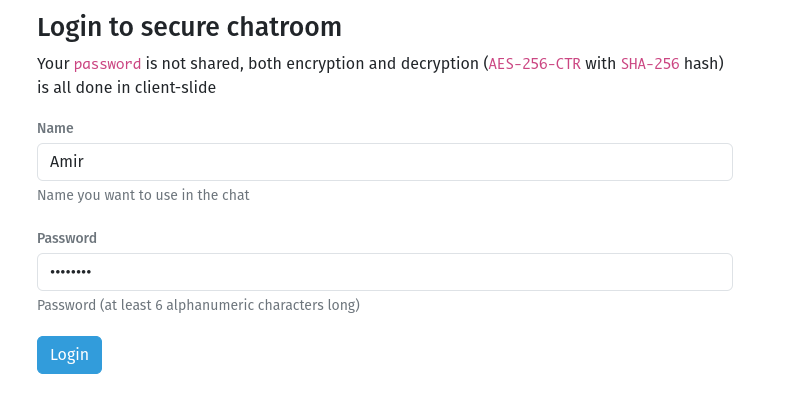
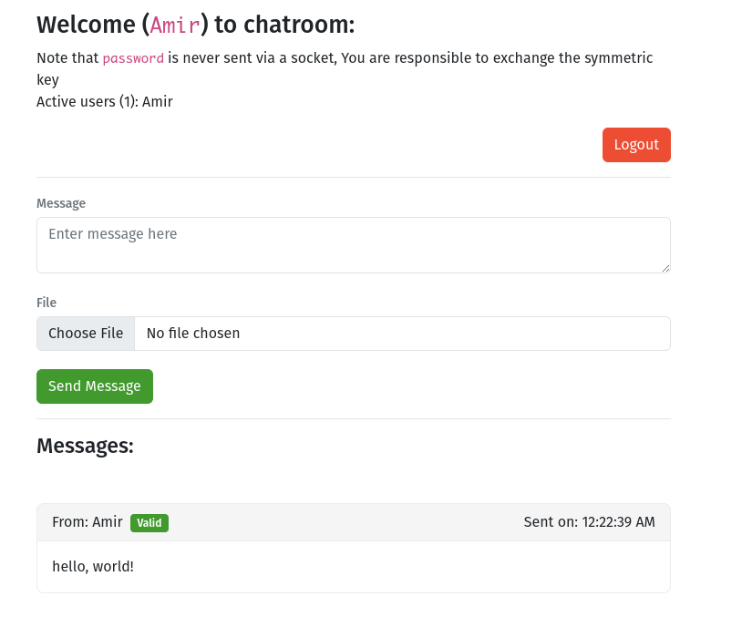

## SymmetricCryptoChatRoom ([URL](http://hesamian.myddns.me:5000/))

[![Docker Hub badge][dockerhub-badge]][dockerhub]

Simple secure chat room web (+ file transfer) application using SignalR (dotnet core) and Angular.js for front-end and most importantly:
- `SHA-256` to hash the given password
- `AES-256-CTR` to encrypt/decrypt the messages

### Note
- `password` is never sent via a socket, You are responsible to exchange the symmetric key
- Both encryption and decryption is all done in client-slide, only ciphertexts are transmitted via Sockets
- File name is transmitted as plaintext but file blob is transmitted as ciphertext
- Max file size is `50mb` (binary format for transport)
- Session password is store as plaintext via a cookie in your browser
- Used [LiteDB](https://www.litedb.org/) to playback messages from 10 minutes ago to just joined users

### Screenshots

--

[dockerhub-badge]: https://img.shields.io/docker/pulls/amir734jj/symmetric-crypto-chatroom
[dockerhub]: https://hub.docker.com/repository/docker/amir734jj/symmetric-crypto-chatroom
