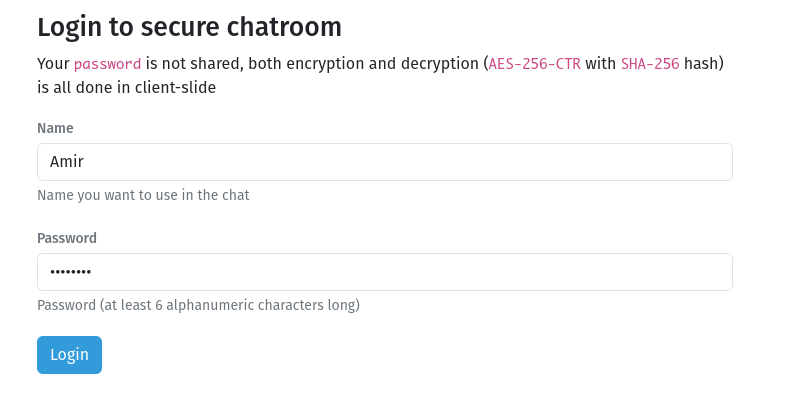
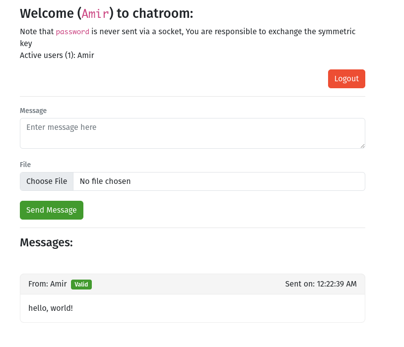

## SymmetricCryptoChatRoom

[![Docker Hub badge][dockerhub-badge]][dockerhub]

Simple secure chat room web (+ file transfer) application using SignalR (dotnet core) and Blazor for front-end and most importantly:
- `SHA-256` to hash the given password
- `AES-256-CTR` to encrypt/decrypt the messages

### Note
- `password` is never sent via a socket, You are responsible to exchange the symmetric key
- Both encryption and decryption is all done in client-slide, only ciphertexts are transmitted via Sockets
- File name is transmitted as plaintext but file blob is transmitted as ciphertext
- Combined attachment size per message is limited to `25 MB`
- Attachments use managed gzip compression before encryption when it reduces their size
- Session password is store as plaintext via a cookie in your browser
- Used [LiteDB](https://www.litedb.org/) to playback messages from 10 minutes ago to just joined users
- [Fody.PropertyChanged](https://github.com/Fody/PropertyChanged) to detect if any of state's properties changes which triggers re-renders of UI

### Self-hosted voice channel

The chat application and coturn are deployed as separate Dockerfile-based services. The coturn image is maintained in the sibling `stun-turn-setup` repository. No public STUN/TURN service is configured. Encoded audio frames are encrypted with length-preserving AES-256-CTR using a PBKDF2 key derived from the channel name and shared chat password. WebRTC DTLS-SRTP authenticates and encrypts the media transport as a second protection layer.

Password-encrypted voice requires a browser with `RTCRtpScriptTransform` support. The voice connection fails closed when encoded transforms are unavailable; it never sends voice protected only by WebRTC transport encryption.

Voice quality defaults to Auto at the 32 kbps Medium profile. It promotes to the 64 kbps High profile after sustained good packet loss, round-trip time, and outgoing-bandwidth measurements, then falls back to Medium when conditions degrade. Manual Low, Medium, and High modes remain available.

Microphone audio uses real-time echo cancellation, noise suppression, and automatic gain control. Browsers that expose native voice isolation use it automatically; other browsers retain the standard WebRTC noise suppression fallback. The ICE debug view reports which processing features are supported and active.

While voice is active, supported mobile browsers keep the screen awake and use their communication audio-session mode. Manually locking the device can still suspend a browser call when the mobile operating system does not allow background microphone or WebRTC activity.

Supported iOS browsers show an in-call **Audio output** selector with Auto, Earpiece, and Speaker modes. Auto delegates routing to the phone's call audio session so the operating system can apply its proximity behavior; browsers do not expose the raw proximity sensor to the application. Earpiece and Speaker request a fixed handset route. Browsers implementing the Audio Output Devices API instead show **Choose output** for selecting a speaker, wired headset, or Bluetooth device through the system picker. Browsers without either API continue using the operating system's default route.

`TURN_RELAY_ONLY` defaults to `true`. In this mode WebRTC uses `iceTransportPolicy: "relay"`, so voice fails instead of connecting directly when the configured coturn service is unavailable. Set it to `false` only when direct peer-to-peer paths through the configured STUN server are acceptable.

Set `TURN_EXTERNAL_IP` on the coturn service to its Docker host's public IPv4 address. Also publish and allow TCP/UDP 3478 and UDP 49160-49200 through the host firewall and network security rules. Set `TURN_HOST` on the chat service to the public DNS name clients should use.

Set `TURN_SECRET` explicitly. The API uses it to issue short-lived credentials, and the coturn service uses the same value to validate them.

Microphone access requires a secure browser context. Use a trusted HTTPS certificate in production, either at a reverse proxy on the same host or by configuring ASP.NET Core HTTPS and mounting the certificate into the container. Plain HTTP works only on `localhost` for browser media capture.

### Android application

The `Mobile` Capacitor project packages the deployed web application in an Android WebView and adds native speaker, earpiece, and proximity-based routing. Auto mode preserves wired or Bluetooth communication devices and otherwise switches between the built-in earpiece and speaker using the phone's proximity sensor.

An active Android voice call runs with a microphone foreground service and an ongoing notification, allowing the call to continue when the app is minimized. Swiping the app away or leaving voice stops the service and ends background operation. This does not receive new calls after Android has suspended or killed the app; reliable wake-up for new incoming calls would require a push service, which is intentionally not configured.

Every push to `master` updates the single `latest` GitHub release and replaces its `symmetric-crypto-chat-latest.apk` asset. Without signing secrets, the workflow publishes a debug-signed APK. Configure all four repository secrets below to publish an upgradeable release-signed APK:

```text
ANDROID_KEYSTORE_BASE64
ANDROID_KEYSTORE_PASSWORD
ANDROID_KEY_ALIAS
ANDROID_KEY_PASSWORD
```

Generate a release keystore once, Base64-encode the entire keystore file, and store that value in `ANDROID_KEYSTORE_BASE64`. Keep the same keystore for every build; changing it prevents Android from installing a new APK over an existing installation. GitHub Release immutability must remain disabled because the workflow intentionally replaces the asset in the rolling release.

The Android shell currently loads `https://chat.coolify.hesamian.com/login`, configured in `Mobile/capacitor.config.json`. The device must have an up-to-date Android System WebView that supports `RTCRtpScriptTransform`, which remains required for encrypted voice.

#### Coolify

Create a Dockerfile resource for this repository and route `chat.coolify.hesamian.com` to container port `3000`. Configure persistent storage at `/app/data` for LiteDB playback data.

The chat image checks `http://127.0.0.1:3000/health` every 30 seconds. Coolify should report the container as healthy after its startup grace period.

Create a second Dockerfile resource from the `stun-turn-setup` repository. Do not add `turn.coolify.hesamian.com` to Coolify's Domains panel because STUN/TURN is not HTTP. Publish TCP/UDP 3478 and UDP 49160-49200 directly from the coturn container to the host.

Set these environment variables on the chat service:

```env
TURN_HOST=turn.coolify.hesamian.com
TURN_SECRET=replace-with-a-long-random-secret
TURN_RELAY_ONLY=true
```

Set these environment variables on the coturn service:

```env
TURN_EXTERNAL_IP=203.0.113.10
TURN_REALM=chat.coolify.hesamian.com
TURN_SECRET=replace-with-the-same-long-random-secret
```

Create a DNS-only `A` record at your DNS provider for `turn.coolify.hesamian.com`, pointing to the value of `TURN_EXTERNAL_IP`. When using Cloudflare, set it to DNS only. Allow TCP/UDP 3478 and UDP 49160-49200 in the server provider's firewall.

To verify relay routing in Chromium or Edge, open `chrome://webrtc-internals` or `edge://webrtc-internals` during a call and inspect the selected ICE candidate pair. The local candidate type must be `relay`, and its relay protocol/address must correspond to the configured `TURN_HOST`. With `TURN_RELAY_ONLY=true`, a non-relay candidate cannot be selected.

### Screenshots


--


[dockerhub-badge]: https://img.shields.io/docker/pulls/amir734jj/symmetric-crypto-chatroom
[dockerhub]: https://hub.docker.com/repository/docker/amir734jj/symmetric-crypto-chatroom
